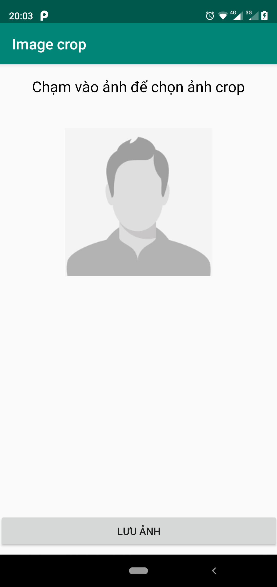
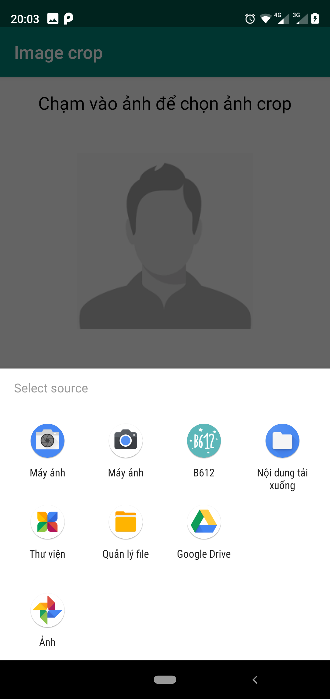
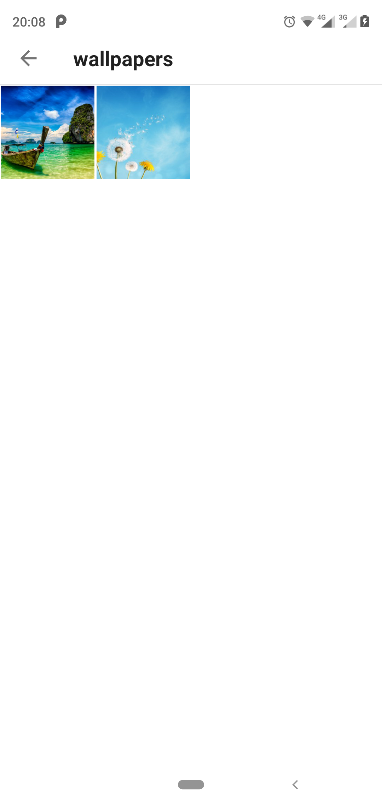
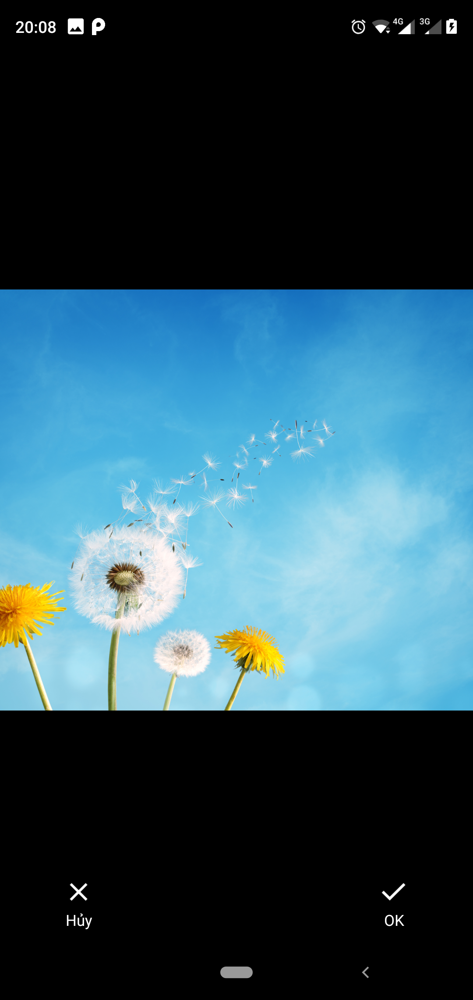
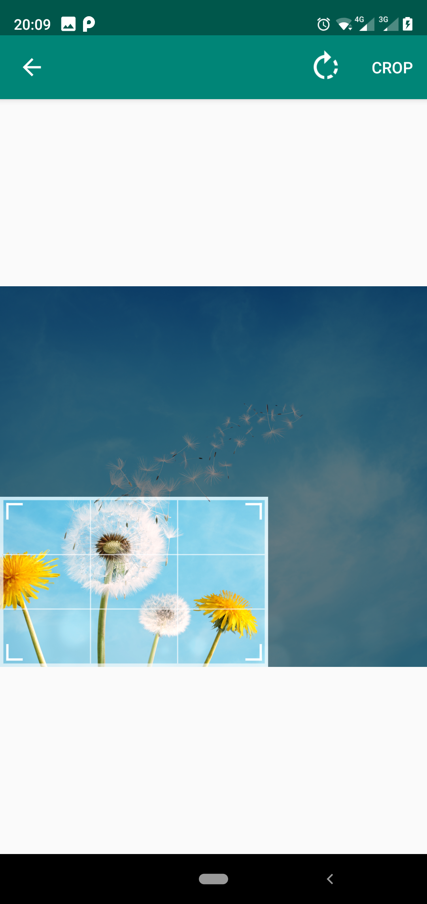
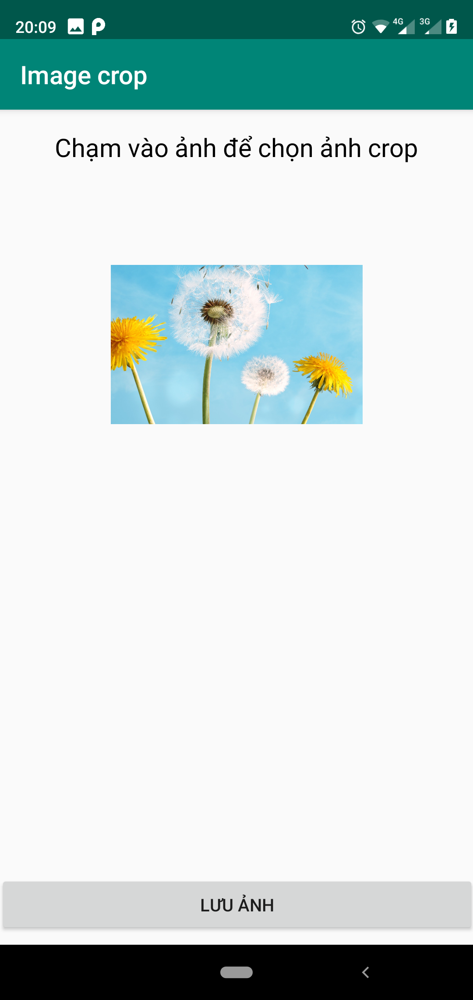
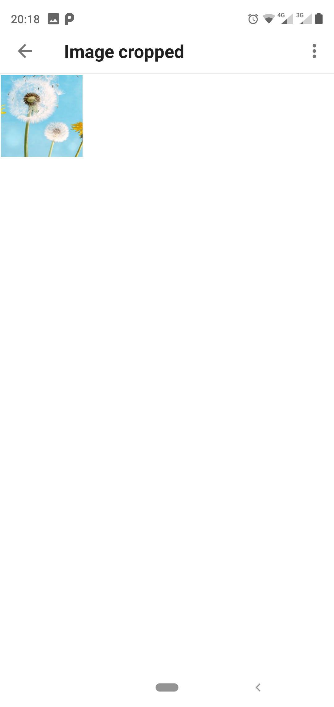

# Ứng dụng crop ảnh sử dụng thư viện Android-Image-Cropper

## Demo ứng dụng

1. Giao diện
	
2. Chọn từ các nguồn khác nhau
	
3. Chọn ảnh
	
4. Xác nhận chọn ảnh
	
5. Bắt đầu crop. Có thể rotate
	
6. Chọn lưu để lưu vào điện thoại
	
7. Ảnh đã lưu trong album mới
	

